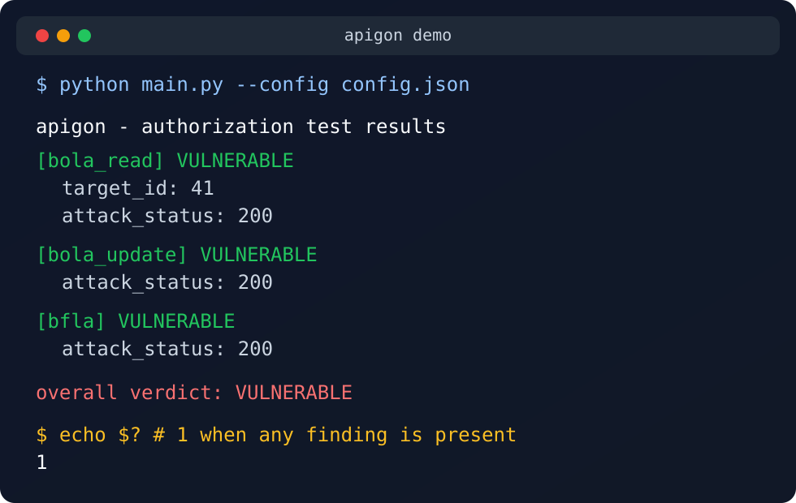

# apigon

A Python CLI that detects common API authorization flaws by exercising real endpoints as two authenticated users and verifying the result from the owner's perspective.

[](https://github.com/0xn3by/apigon/actions/workflows/tests.yml)
[](https://www.python.org/)
[](LICENSE)

Apigon helps answer one question quickly: can one authenticated user read, modify, or delete another user's data, or reach privileged API functionality they should not have.

- Two authenticated users: one victim, one low-privileged attacker.
- Owner-side verification to reduce false positives from soft-404 or no-op APIs.
- Non-zero exit code on findings, so it fits directly into CI.



## Problem Statement

API authorization flaws are difficult to detect because a `200 OK` is not enough evidence. Many APIs return placeholder data for invalid object IDs, silently ignore writes, or expose behavior that looks successful from the attacker's side only.

Apigon uses two authenticated users because object-level authorization is inherently relational: the tool needs one user to create or own the resource, and a different low-privileged user to attempt access against that same resource.

Owner-side verification reduces false positives by checking the target resource from the victim's perspective before and after the attack. That makes soft-404 responses, echoed IDs, and fake-success update or delete responses much less likely to be reported as real vulnerabilities.

## Security And Responsible Use

- Authorized targets only.
- Update and delete checks can modify or remove data.
- Prefer staging environments and disposable test accounts.
- Review each configured endpoint before running against anything shared or production-like.

## Detection Workflow

```text
Authenticate users
  -> create owner resource
  -> test as low-privileged user
  -> verify as owner
  -> report result
```

## Key Features

- BOLA read detection compares the attacker's response with the owner's real view of the same object.
- Update and delete checks verify the object's state after the attack instead of trusting status codes.
- BFLA checks probe restricted endpoints with the low-privileged user.
- Mass-assignment checks inject privileged fields and report only fields the server actually accepted.
- Login, client construction, and runner flow all support injectable `httpx.MockTransport` testing.

## Tech Stack

- Python 3.10+
- `httpx` — authenticated HTTP clients, request building, mockable transports
- `dataclasses` — typed config model (`Config`, `AuthSpec`, `LoginSpec`, `UserSpec`, `RequestSpec`)
- `argparse` — CLI argument parsing (`--config`, `--init-config`)
- `re`, `os`, `json` — `${VAR}` env resolution, `.env` loading, config (de)serialization
- `pytest` + `httpx.MockTransport` — unit and integration tests, no live API required

## Installation

### Prerequisites

- Python 3.10 or later
- `pip`

### Run locally

```bash
git clone https://github.com/0xn3by/apigon.git
cd apigon
python3 -m venv .venv
.venv/bin/pip install -r requirements.txt
.venv/bin/python main.py --init-config config.json
```

### Run against a real target

```bash
# edit config.json (and .env, if using the login flow) with your target's
# base_url, credentials or tokens, and endpoint paths, then:
.venv/bin/python main.py --config config.json
```

## Minimal Configuration

```json
{
  "base_url": "https://api.example.com",
  "user_a": { "auth": { "type": "bearer", "token": "${ATTACKER_TOKEN}" } },
  "user_b": { "auth": { "type": "bearer", "token": "${VICTIM_TOKEN}" } },
  "create": { "method": "POST", "path": "/orders", "json": { "item": "demo" } },
  "fetch": { "method": "GET", "path": "/orders/{id}" }
}
```

## Configuration Options

| Key | Required | Purpose |
| --- | --- | --- |
| `base_url` | Yes | Target API base URL. |
| `timeout` | No | Request timeout in seconds. Default: `10`. |
| `verify_tls` | No | Enable TLS certificate verification. Default: `true`. |
| `login` | No | Login request spec used to exchange credentials for a token. |
| `user_a` | Yes | Low-privileged attacker identity. |
| `user_b` | Yes | Victim or owner identity. |
| `create` | Yes | Request spec used to create the owner's resource. |
| `fetch` | Yes | Request spec used to read the resource by `{id}`. |
| `update` | No | Enables the BOLA update check when present. |
| `delete` | No | Enables the BOLA delete check when present. |
| `admin` | No | Enables the BFLA check when present. |
| `privileged_fields` | No | Enables mass-assignment checks when present. |

Generate a starter file:

```bash
python main.py --init-config config.json
```

Notes:
- `base_url`, `user_a`, `user_b`, `create`, and `fetch` are the only required keys.
- `${ENV_VAR}` placeholders are resolved recursively, with optional `.env` loading.
- Exit code is `1` on findings, `0` when clean, and `2` on config or network errors.

## Example Output

```bash
$ python main.py --config config.json
apigon - authorization test results
----------------------------------------
[bola_read] VULNERABLE
    target_id: 41
    create_status: 201
    attack_status: 200
[bola_update] not vulnerable
    target_id: 41
    attack_status: 403
[bfla] VULNERABLE
    attack_status: 200
----------------------------------------
overall verdict: VULNERABLE
$ echo $?
1
```

## Testing

```bash
python -m pytest
```

The suite runs against `httpx.MockTransport`, so no live API is required.

## CI Usage

Use the process exit code directly so findings fail the pipeline:

```yaml
- name: Run Apigon
  run: python main.py --config config.json
```

## Core Modules

### `main.py`

- `main(argv)` — parses `--config`/`--init-config`, loads the config, calls `run()`, prints the report, and returns the process exit code
- `--init-config PATH` writes `SAMPLE_CONFIG` to disk and exits without running any checks

### `config.py`

- `Config.load()` / `Config.from_dict()` — parse and validate the JSON config into typed dataclasses, wrapping any missing required key in a `ValueError`
- `resolve_env()` — recursively substitutes `${VAR}` placeholders through strings, dicts, and lists
- `load_dotenv()` — loads a `.env` file without ever overriding a real environment variable
- `AuthSpec`, `LoginSpec`, `UserSpec`, `RequestSpec` — typed specs for auth, login, per-user identity, and templated requests

### `auth.py`

- `login()` — POSTs credentials to the configured login endpoint and returns the issued token, raising on a failed request, non-JSON response, or missing token field
- `_dig()` — walks a dot-separated path (e.g. `data.token`) into a nested JSON response

### `client.py`

- `build_client()` — constructs an authenticated `httpx.Client` for one user, with an injectable `transport` for tests
- `make_create()` / `make_fetch()` / `make_update()` — turn a `RequestSpec` into a callable; `make_fetch` is reused for both `fetch` and `delete` since neither sends a body

### `checks.py`

- `bola_read_test()` / `_leak_confirmed()` — the oracle-safe BOLA read check
- `bola_update_test()` / `bola_delete_test()` — confirm real mutation by diffing the owner's before/after state
- `bfla_test()` — flags a low-privilege client reaching a restricted endpoint
- `mass_assignment_test()` — flags privileged fields the server accepts from an untrusted create payload

### `runner.py`

- `run()` — logs in both users, builds their clients, and runs every check the config enables
- `report()` — prints a per-check verdict plus an overall verdict to stdout

## Project Structure

```text
apigon/
├── main.py               # CLI entry point and argument parsing
├── config.py              # Typed config model, env/`.env` resolution
├── auth.py                 # Login flow and token extraction
├── client.py                # httpx client + request builders
├── checks.py                 # BOLA/BFLA/mass-assignment check logic
├── runner.py                  # Wires config -> clients -> checks -> report
├── config.json                 # Example config
├── requirements.txt             # Runtime dependency (httpx)
├── requirements-dev.txt          # Adds pytest for local testing
├── pytest.ini                     # Test discovery + import path config
├── tests/                          # Unit + integration tests (MockTransport, no network)
├── .gitignore                       # Excludes .env, __pycache__, .venv, .pytest_cache
└── LICENSE                           # MIT License
```

## Current Limitations

- Each run probes one freshly created object, not a broad object-ID search space.
- No retry or backoff behavior for unstable targets.
- Checks run sequentially.
- `create` responses must expose an `id` field in JSON.
- BFLA currently tests one configured privileged endpoint per run.

## License

Licensed under the [MIT License](LICENSE).
